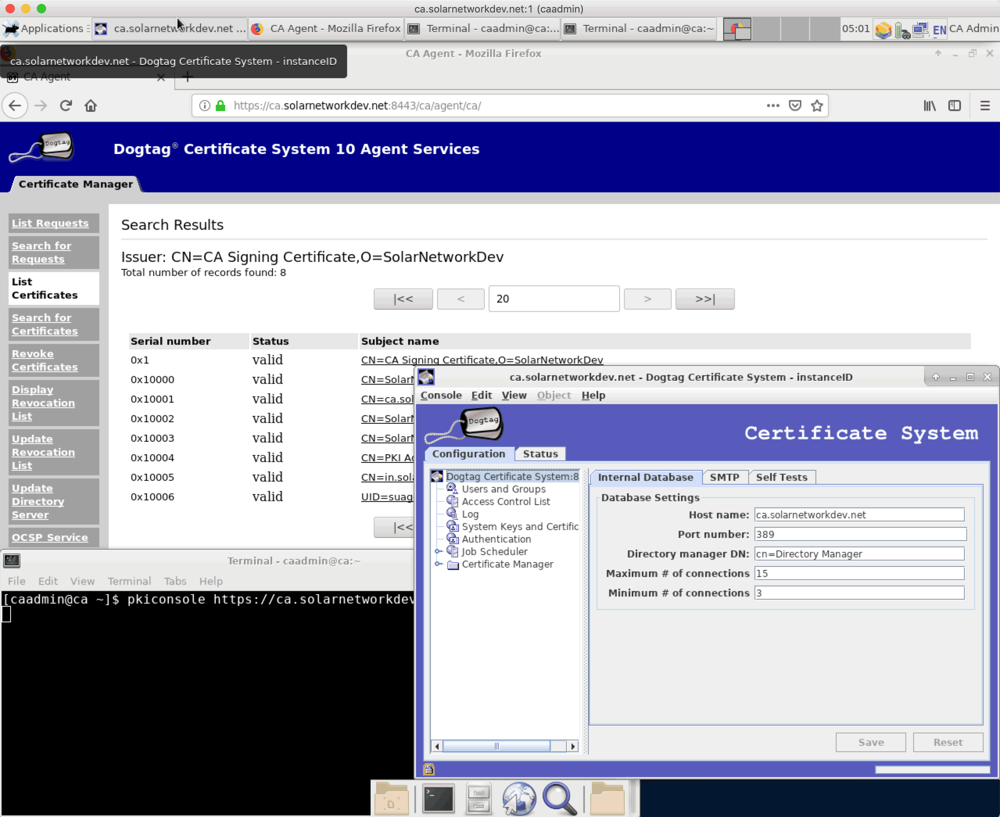

# SolarCA Virtual Machine - Dogtag PKI

This is a [Vagrant][vagrant] configuration for a virtual machine configured with the Dogtag PKI
Certification Authority (CA) system, suitable for use by SolarNetwork as its CA system for issuing
SolarNode certificates. The VM is configured as a full desktop system to facilitate ease of
administration via VNC.



# Quick Start

First, take a peek at the section on [tweaking the VM RAM/CPU settings](#tweaking-vm-ramcpu-settings).
Then to create a Dogtag instance with default (development focused) settings, run:

```sh
vagrant up
```

Then run out and grab a ☕️ or 🍩 (or both). Take your time, because it will take several minutes for
the VM to download/configure everything necessary. Once everything is ready, an installation report
will be printed to the screen that details everything you need to know about what was done.

# Tweaking VM RAM/CPU settings

The basic VM config allocates 1GB of RAM and 1 CPU. If you can afford the resources, you might allocate
a bit more by creating a `Vagrantfile.local` file with the following:

```
cpu_count=2
memory_size=2048
```

# Debugging Dogtag Server

You can create  a `/etc/tomcat/conf.d/debug.conf` file with JVM parameters to pass to the Tomcat
server, like

```
JAVA_OPTS="-Djavax.net.debug=ssl:handshake:verbose -Xdebug -Xnoagent -Xrunjdwp:server=y,transport=dt_socket,address=9000,suspend=n"
```

[vagrant]: https://www.vagrantup.com/
